# REAL ESTATE WEB APPLICATION

> It is a Real Estate Business Web Application built using Python - Django, PostgreSQL, HTML5, CSS3, Bootstrap, JavaScript, Maps Embed API which allows users to see listings, search them based on various preferred criteria, see the nearby places in map and can also connect with Realtors. Realtors and the admin staff obtain e-mail for each inquiry made by the Users

## Table of contents
* [Technologies](#technologies)
* [Running the Application](#running-the-application)
* [Screenshots](#screenshots)
* [Contact](#contact)

## Technologies
* Web Framework - Python - Django
* Database - PostgreSQL
* Web Technologies - HTML5, CSS3,  Bootstrap, JavaScript, Maps Embed API

## Running the Application
* Step 1: To run the Django app on your local computer setup a python development environment including python, PIP, Virtualenv.
* Step 2: Create an Isolated Python environment and install dependencies.
* Step 3: Run the Django migrations to setup your models.
* Step 4: Start a local web server by running this command in terminal: python manage.py runserver and open browser go to http://localhost:8000
* Step 5: Running the Real estate admin Console: Create a super user you need to define a user name and password
* Step 6: Start a local web server : Python Manage.py run server and open browser go to http://localhost:8000/admin 
* Step 7: Login to the admin site using the username and password you used. Here, Username : Admin and Password : Pass

## Screenshots
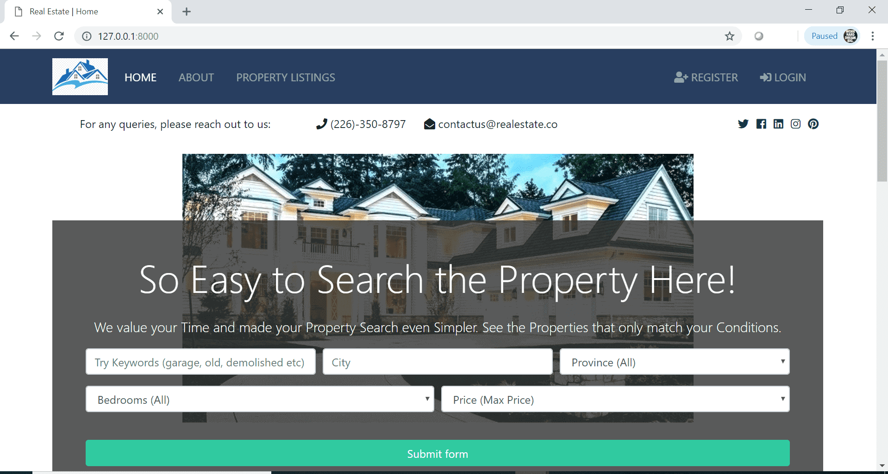 
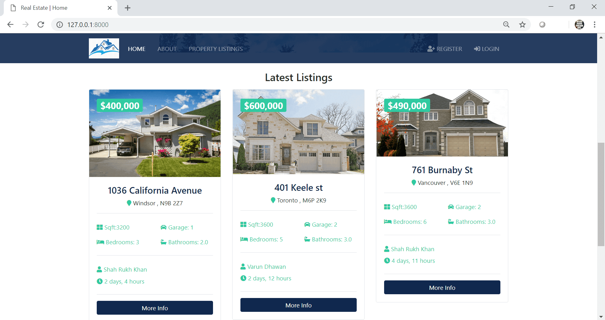
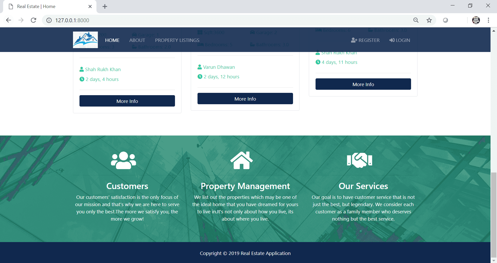
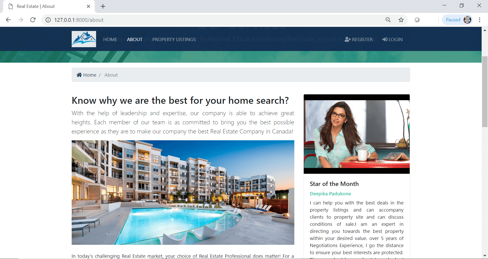
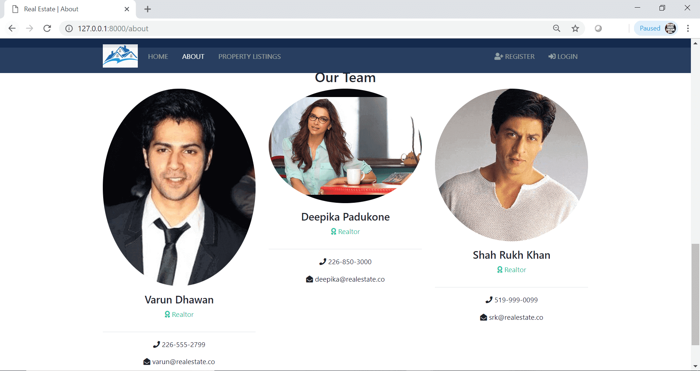
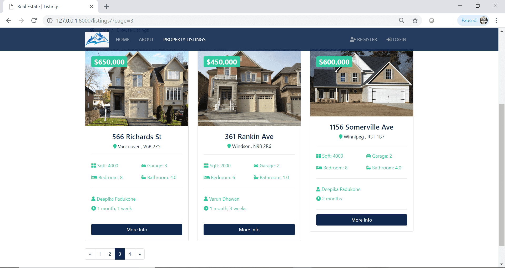
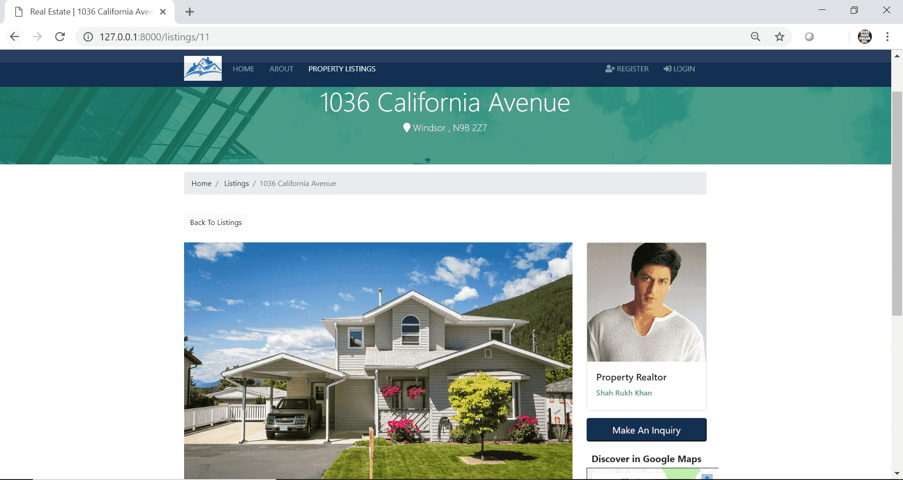
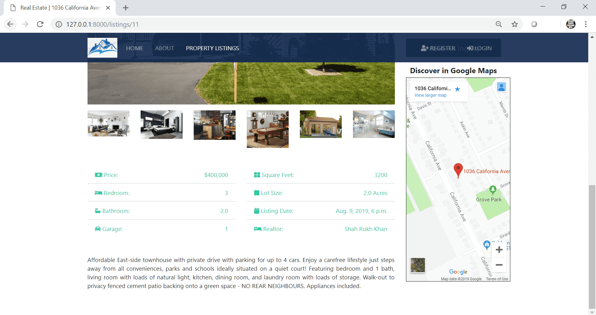
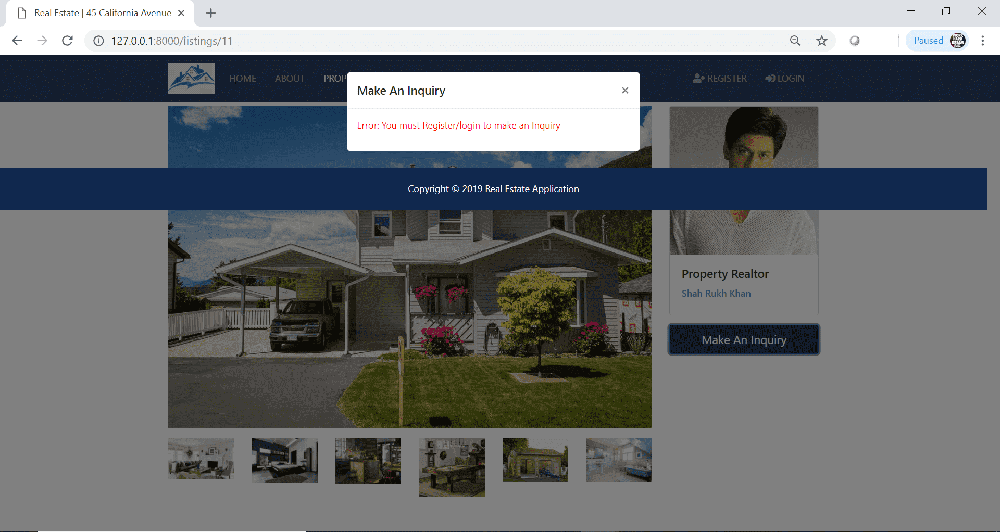
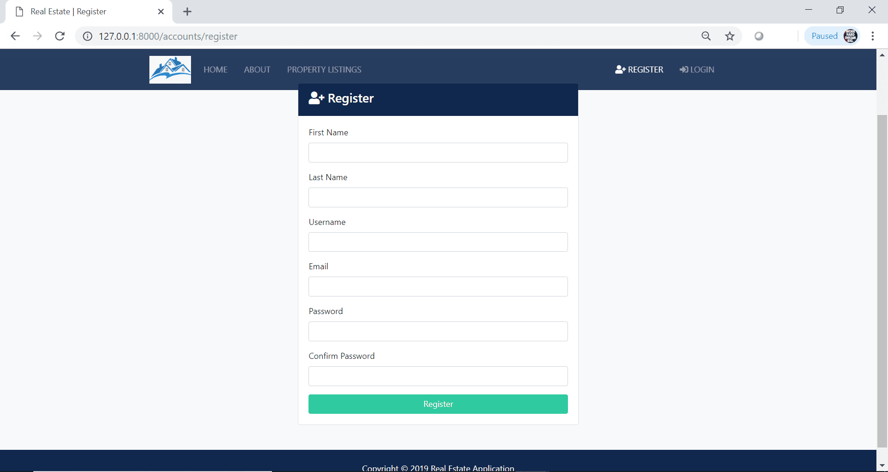
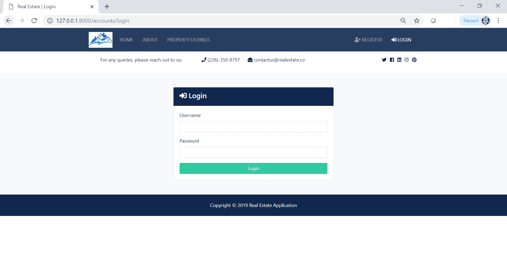
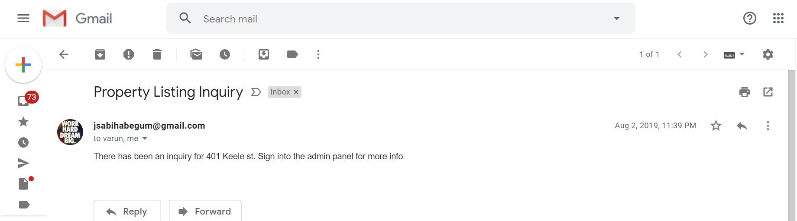
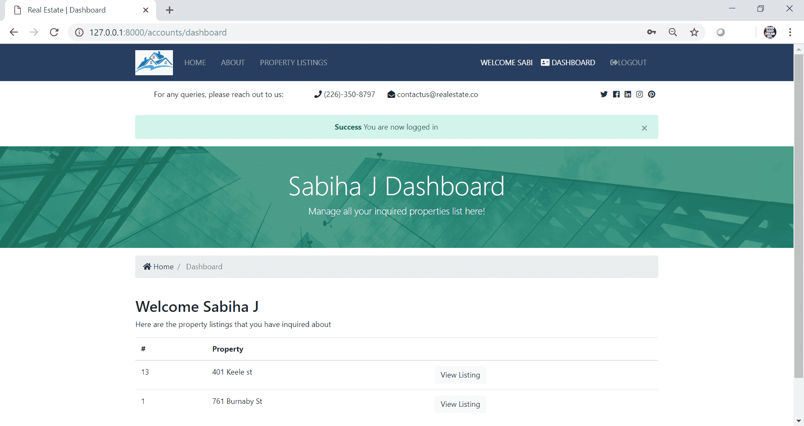
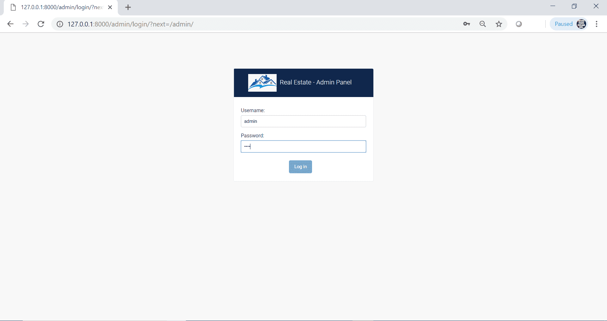
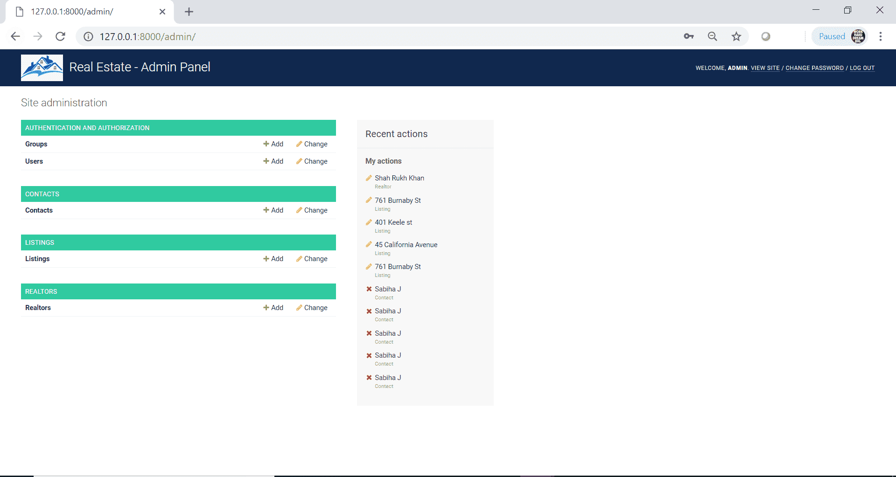

## Contact
[Sabiha Begum Jaggir Hussain](https://sabihabegumj.com/) - feel free to contact me!
